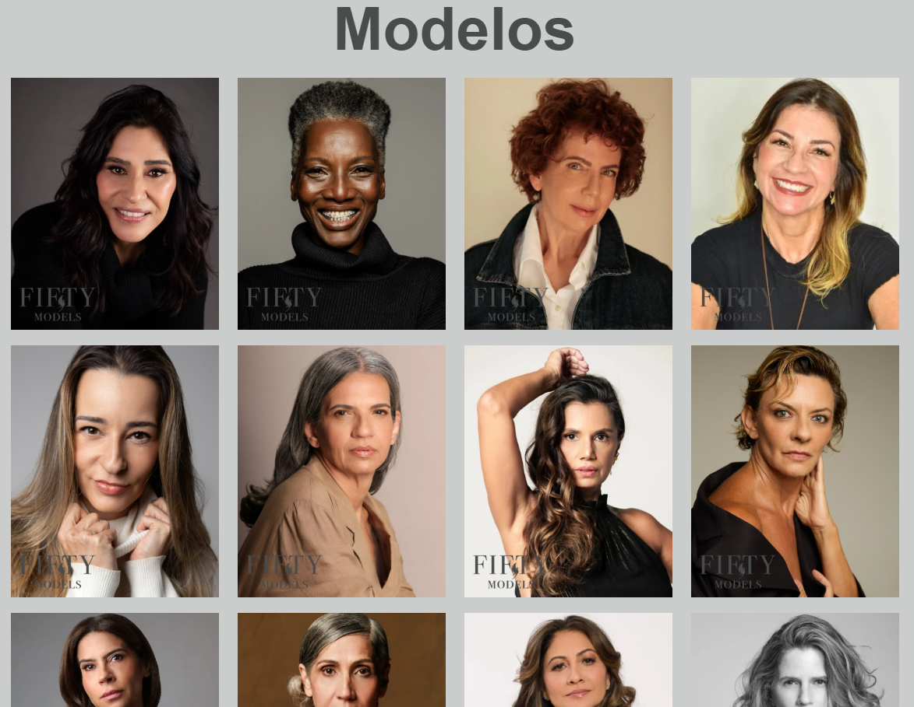
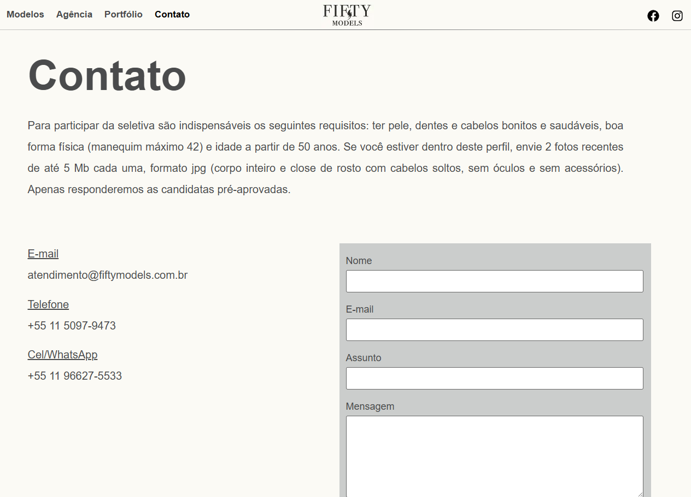

<!-- Banner -->

  

<h1 align="center">🌐 Fifty Models — Official Website</h1>

  A modern, responsive and editorial-style website built with WordPress and Elementor for the Brazilian model agency Fifty Models.

  
  
  
  

---

## 🔗 Live Website

  <a href="https://www.fiftymodels.com.br" target="_blank"><b>www.fiftymodels.com.br</b></a>

---

## ✨ Project Overview

Fifty Models is a São Paulo–based model agency that needed a clean, elegant and easy-to-update website to showcase its talent portfolio.

The goal was to create a digital presence that reflects the agency’s identity:

- modern and editorial design  
- intuitive navigation  
- fast loading  
- mobile-first experience  
- easy internal updates  
- strong visual presentation of models  

The website was built using:

- **WordPress CMS**  
- **Elementor Page Builder**  
- **Custom CSS**  
- **Optimized plugins**  
- **SEO-friendly structure**

---

## 🖥️ Main Pages

### **Home**

  

### **About**

  

### **Models**

  

### **Model Profile**

  

### **Contact**

  

---

## 📱 Mobile Experience

The website was designed with a mobile-first approach, ensuring:

- fluid navigation  
- optimized menus  
- responsive grids  
- fast loading on mobile networks  

  
  

---

## 🚀 Features

- ✔ Fully responsive design  
- ✔ Built with WordPress + Elementor  
- ✔ Custom CSS enhancements  
- ✔ Optimized for performance  
- ✔ SEO-ready structure  
- ✔ Easy-to-update model catalog  
- ✔ Clean and editorial visual identity  

---

## 🛠️ Tech Stack

- **WordPress CMS**  
- **Elementor Page Builder**  
- **Custom CSS**  
- **Contact Form plugin**  
- **Performance optimization plugins**  
- **SEO tools**

---

## 🎯 Goals Achieved

- Professional and elegant online presence  
- Fast and responsive layout  
- Easy content management for the agency  
- Strong visual presentation of models  
- Consistent branding across all pages  

---

## 👤 Author

**Rodrigo von Horn** — São Paulo, Brazil  
Web development, UI/UX and digital solutions.

---